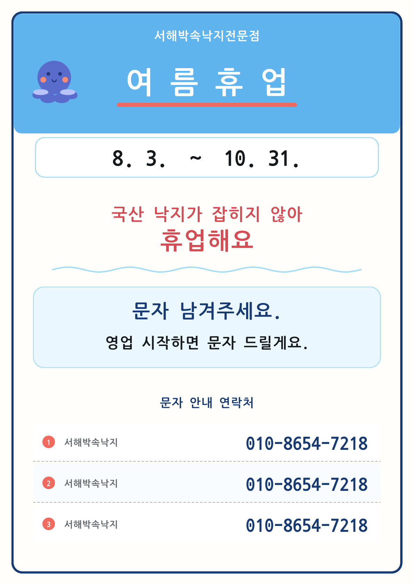
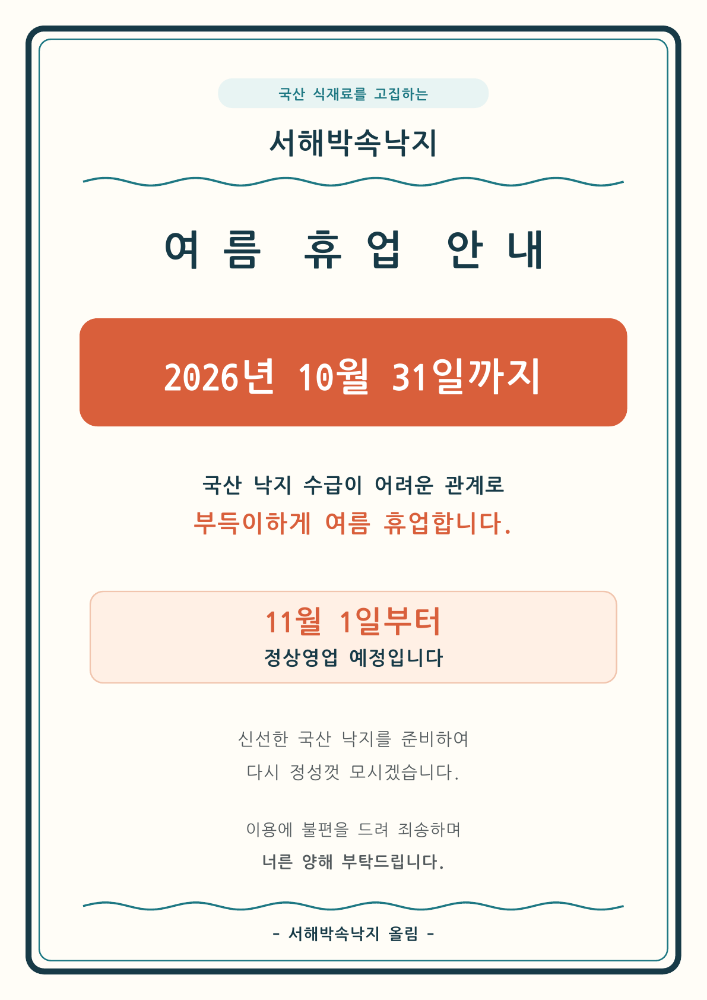

# 2026-08-09 서해박속낙지 여름휴업 안내문 제작 기록

## 1. 정리 개요

| 항목 | 내용 |
|---|---|
| 상호 | 서해박속낙지전문점 |
| 목적 | 가게 출입문 등에 붙일 A4 세로형 여름휴업 안내문 제작 |
| 휴업 기간 | 2026년 8월 3일 ~ 2026년 10월 31일 |
| 휴업 사유 | 국산 낙지가 잡히지 않아 영업 재료 수급이 어려움 |
| 문자 안내 | 고객이 문자를 남기면 영업 시작 시 회신 |
| 안내 전화 | 010-8654-7218 |
| 최종 인쇄물 | `pdf/20260809_서해박속낙지_여름휴업_문자안내_A4.pdf` |
| 권장 인쇄 설정 | A4 세로 · 실제 크기 100% |

## 2. 최종 확정 문구

> 서해박속낙지전문점  
> 여름휴업  
> 8. 3. ~ 10. 31.  
> 국산 낙지가 잡히지 않아 휴업해요.  
> 문자 남겨주세요.  
> 영업 시작하면 문자 드릴게요.  
> 010-8654-7218

최종 PDF 하단에는 연락처를 가져갈 수 있도록 전화번호를 3번 반복해 배치했다.

## 3. 작업 경과

| 순서 | 요청·결과 |
|---:|---|
| 1 | 국산 낙지 수급 문제로 10월 31일까지 휴업한다는 A4 안내문 제작 요청 |
| 2 | 휴업 사유, 종료일, 11월 1일 정상영업 예정 내용을 넣은 1차 A4 안내문 제작 |
| 3 | 기존 안내 이미지 3장과 최종 문구·전화번호를 제공하여 디자인 및 문구 수정 요청 |
| 4 | 제목 → 기간 → 휴업 사유 → 문자 안내 → 연락처 순서로 재구성 |
| 5 | 하단에 `010-8654-7218`을 3번 넣은 A4 최종 PDF 제작 |
| 6 | A4 한 장, 글자 잘림, 휴업 기간, 전화번호 반복 횟수를 확인한 뒤 최종본 확정 |

## 4. 이미지 자료

### 4-1. 2026년 가로형 안내 시안

### 4-2. 2026년 정사각형 안내 시안

### 4-3. 2024년 과거 안내문

> 참고: 아래 이미지는 `2024년 8월 4일 ~ 9월 30일`로 적힌 과거 디자인 참고본이다. 2026년 안내 기간으로 사용하면 안 된다.

### 4-4. 최종 A4 문자 안내문 미리보기

### 4-5. 1차 A4 안내문 미리보기

## 5. 최종 산출물

| 파일 | 용도 |
|---|---|
| [최종 A4 문자 안내문](pdf/20260809_서해박속낙지_여름휴업_문자안내_A4.pdf) | 요청 문구와 전화번호 3개를 반영한 최종 인쇄본 |
| [1차 A4 안내문](pdf/20260809_서해박속낙지_여름휴업_안내문_A4.pdf) | 11월 1일 정상영업 예정 문구를 넣었던 1차 인쇄본 |

## 6. 포함 파일 구성

| 경로 | 내용 |
|---|---|
| `README.md` | 본 정리 문서 |
| `index.html` | 브라우저에서 보는 동일 내용 |
| `images/` | 원본 이미지 3장과 PDF 미리보기 2장 |
| `pdf/` | 최종본·1차본 A4 PDF 2개 |
| `sources/` | 전달된 서해박속낙지 운영·사이트·소개 참고자료 4개 |

## 7. 인쇄 안내

1. `pdf/20260809_서해박속낙지_여름휴업_문자안내_A4.pdf`를 연다.
2. 용지 크기를 **A4**, 방향을 **세로**로 지정한다.
3. 배율은 **실제 크기 또는 100%**로 설정한다.
4. 자동 확대·축소가 켜져 있으면 해제한다.
5. 1부 시험 출력 후 테두리와 하단 연락처가 잘리지 않는지 확인한다.

---

정리 기준일: 2026-10-05  
원 제작일: 2026-08-09
