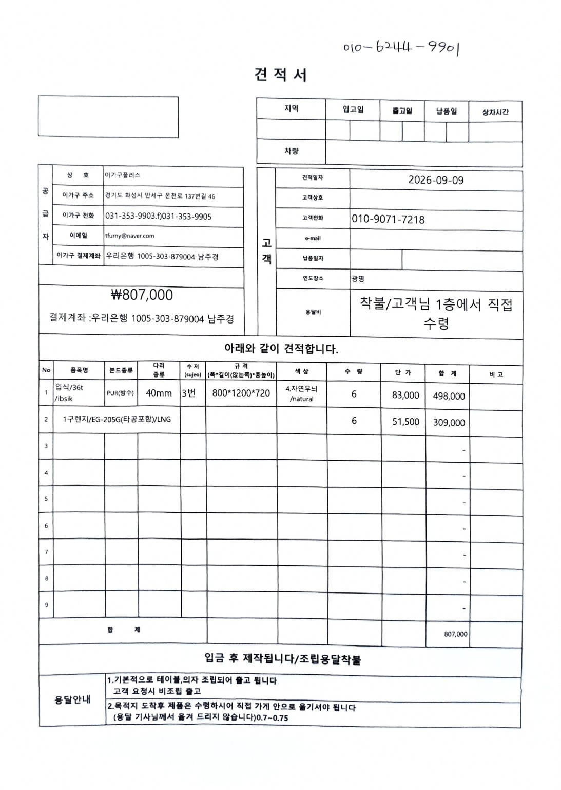
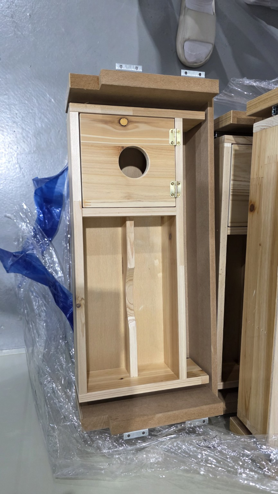
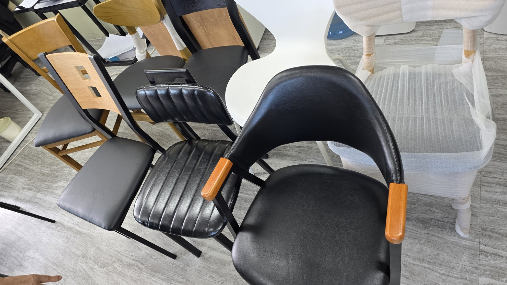
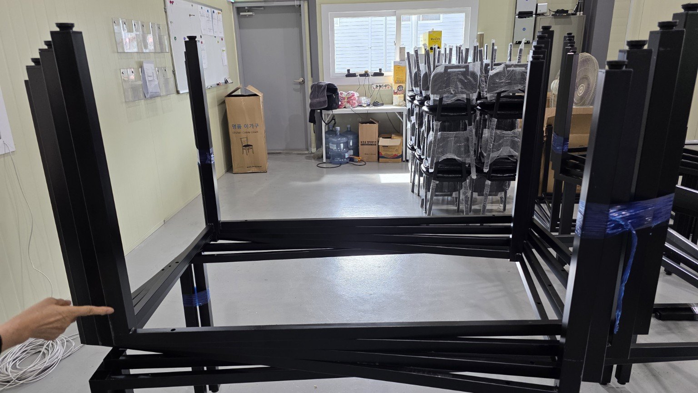
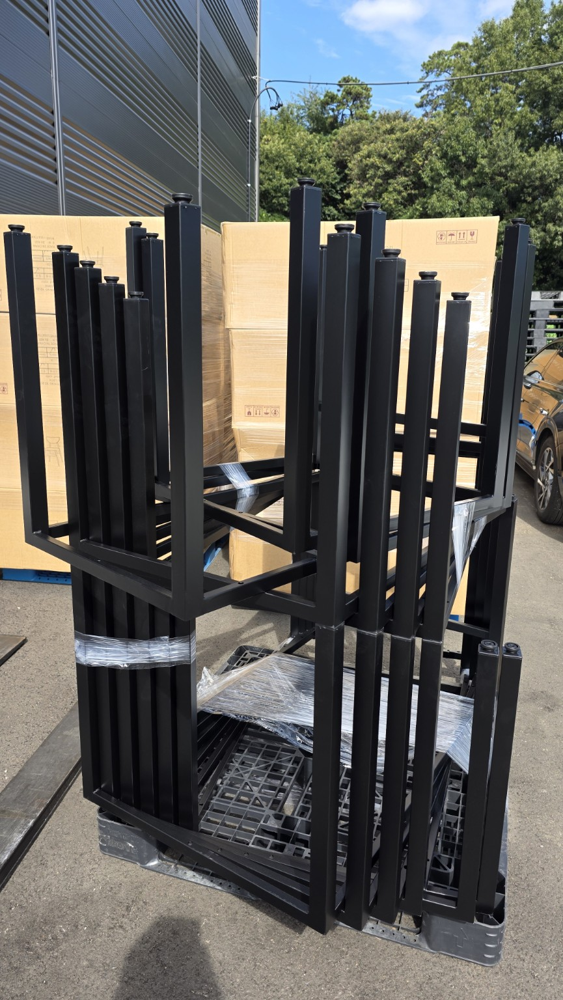
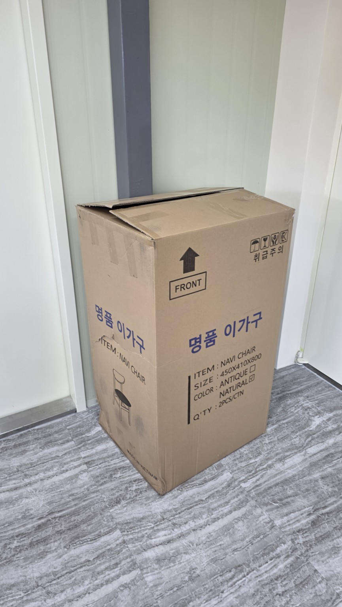
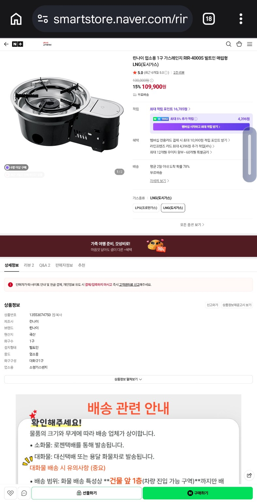

# 2026년 09월 서해박속낙지 이가구·가스설비 기록

## 핵심 일정
| 날짜 | 내용 | 상태 |
|---|---|---|
| 2026-09-09 | 이가구 방문 및 계약 | 완료 |
| 2026-09-14(월) 오전 | 이가구 가구 배송 | 예정 |
| 2026-09-18(금) 10:00 | 가스 11개 연결 | 예정 |

## 이가구
- 주소: **경기도 화성시 만세구 팔탄면 온천로 137번길 46**
- 계약일: **2026년 09월 09일**
- 배송: **2026년 09월 14일 월요일 오전 예정**

### 견적
| 품목 | 내용 | 수량 | 단가 | 합계 |
|---|---|---:|---:|---:|
| 입식 테이블 | 36T / 800×1200×720mm / 자연무늬 | 6 | 83,000원 | 498,000원 |
| 1구 렌지 | EG-205G / 타공 포함 / LNG | 6 | 51,500원 | 309,000원 |
| **합계** | | | | **807,000원** |

## 린나이 RIR-4000S 별도 구매
- 린나이대리점 네이버 스마트스토어
- LNG(도시가스)
- **109,900원 × 5대 = 549,500원**
- 상품: https://smartstore.naver.com/rinnai-3651/products/13553074750?NaPm=ct%3Dmttplbhg%7Cci%3Dcheckout%7Ctr%3Dppc%7Ctrx%3Dnull%7Chk%3Db6cdde31a40bf43aa29a1fff7f49495b5a6a6f55

## 가스 연결
- **2026년 09월 18일 금요일 오전 10시 예정**
- 연결: **11개**
- 단가: **1개 10,000원**
- 총 비용: **110,000원**
- 계산: **10,000원 × 11개 = 110,000원**

## 사진 자료
### 이가구 견적서

### 테이블 내부 구조

### 의자 샘플

### 테이블 프레임

### 테이블 프레임 적재 상태

### 의자 포장 상태

### 린나이 RIR-4000S 상품 화면

