# 서해박속낙지 RIR-4000S 5대 배송·제품확인·배포 통합 기록

> 기록 기준: 2026-09-11 배송 완료 / 2026-09-14 설명서·라벨 보강 / 2026-09~10월 공개·비공개 배포 구조 정비

## 1. 핵심 요약

| 항목 | 내용 |
|---|---|
| 업소 | 서해박속낙지전문점 |
| 배송 완료 | **2026년 9월 11일(금)** |
| 제품 | **린나이 RIR-4000S** 업소용 1구 가스레인지 |
| 가스 | **LNG(도시가스)** |
| 수량 | **5대** |
| 구매 단가 | **109,900원** |
| 구매 합계 | **549,500원** |
| 가스 연결 계획 | 2026-09-18(금) 10:00, 총 11대 |
| 연결 비용 | **110,000원** |

## 2. 배송 및 제품 확인

- RIR-4000S 5대 배송 완료.
- 박스, 제품 본체, 버너 헤드, 삼발이, 스테인리스 상판 및 조절부 확인.
- 인증 라벨에서 **RIR-4000S / LNG / 가스레인지(1구)**를 확인.
- 배송·개봉·제품 상태를 사진 및 동영상으로 기록.

## 3. 실제 사용설명서 기준 제품 규격

| 항목 | 내용 |
|---|---|
| 모델 | RIR-4000S |
| 종류 | 업소용 가스레인지 1구 |
| 크기 | **356 × 517 × 230 mm** |
| 중량 | **4.5 kg** |
| 가스 접속 | **Ø 9.5 mm 가스용 호스** |
| 도시가스 소비량 | **4.65 kW (4,000 kcal/h)** |
| LPG 소비량 | 4.65 kW (0.33 kg/h) |
| 안전장치 | 소화 안전장치 |
| 적용 표준 | KS B 8114 |
| 인증번호 | 제18-0262호 |
| 제조·판매원 | 린나이코리아 주식회사 |
| 서비스 | 1544-3651 |

> 기존 비교자료에 있던 46,500 kcal/h가 아니라, 이번 배송품에 동봉된 사용설명서에는 도시가스 소비량이 **4.65 kW (4,000 kcal/h)**로 기재되어 있어 실제 설명서 값을 기준으로 정리했습니다.

## 4. 배송 5대 개별 식별번호

| 번호 | 모델 | 가스 | 식별번호 |
|---:|---|---|---|
| 1 | RIR-4000S | LNG | **1482822508D0117** |
| 2 | RIR-4000S | LNG | **1482822508D0063** |
| 3 | RIR-4000S | LNG | **1482822508D0062** |
| 4 | RIR-4000S | LNG | **1482822511D0013** |
| 5 | RIR-4000S | LNG | **1482822511D0007** |

## 5. 설치·운영 체크

- [x] 5대 배송 완료
- [x] LNG 제품 여부 확인
- [x] 구성품 및 외관 확인
- [x] 사용설명서 확보
- [x] 개별 제품 라벨 기록
- [ ] 가스 연결 후 점화 확인
- [ ] 화력 조절 확인
- [ ] 가스 누설 여부 확인
- [ ] 실제 테이블 장착 상태 확인

## 6. 공개·비공개 배포 구조

### 공개

- GitHub: `softm/baksok-public` (Public)
- 운영: GitHub Pages
- 공개 아카이브: `https://softm.github.io/baksok-public/`
- 현재 공개본에는 개별 제품 식별번호와 비공개 운영·인증 정보는 제외.

### 비공개

- GitHub: `softm/baksok-private` (Private)
- Vercel: `baksok-private`
- 비공개 운영 URL: `https://baksok-private.vercel.app/`
- 프로젝트 로그인 인증 적용.
- 인증 후 Vercel 서버 함수가 GitHub API로 `main`의 최신 원본을 요청 시 실시간 조회.
- 콘텐츠 변경은 Git에 push하면 웹 요청 시 최신 Git 원본을 읽도록 구성.

### 중앙 인덱스

- 최상위 Projects: `https://softm.github.io/projects/`
- 서해박속낙지 프로젝트 홈: `https://softm.github.io/projects/baksok/`

## 7. 이미지·미디어 목록

1. **RIR-4000S 5대 배송 완료 상태** — `20260910_171012.jpg` (1536×865)
   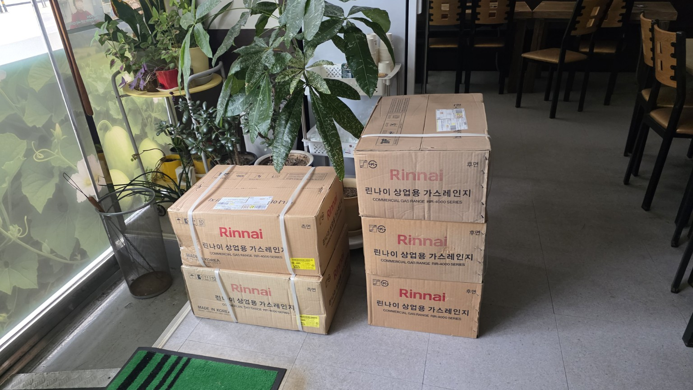

2. **RIR-4000S / LNG 제품 인증 라벨** — `20260910_171117.jpg` (1536×865)
   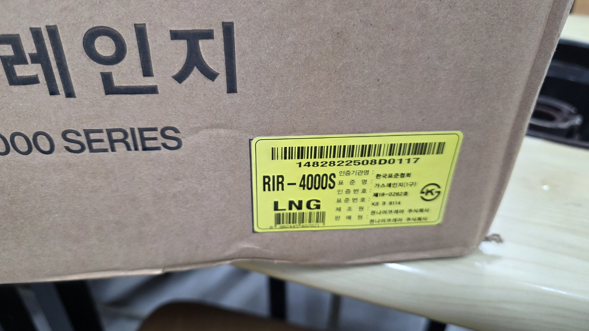

3. **배송 송장 및 제품 박스** — `20260910_171150.jpg` (1536×865)
   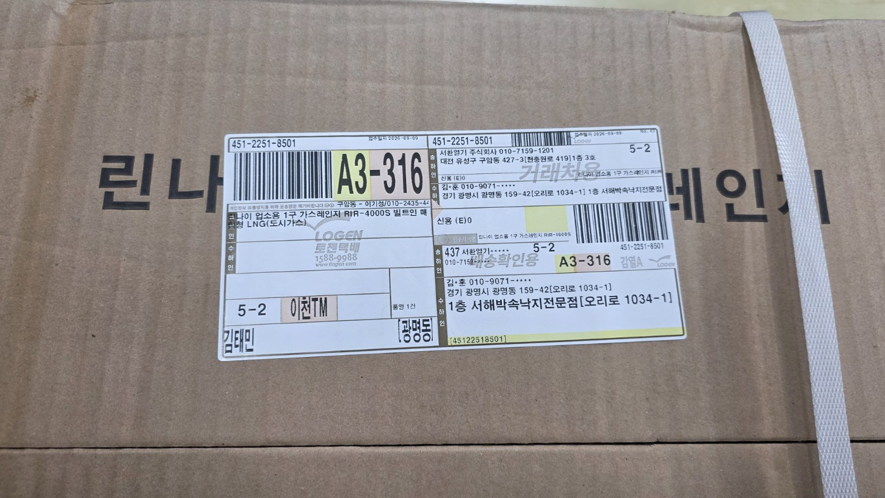

4. **제품 개봉 상태** — `20260910_171311.jpg` (1536×865)
   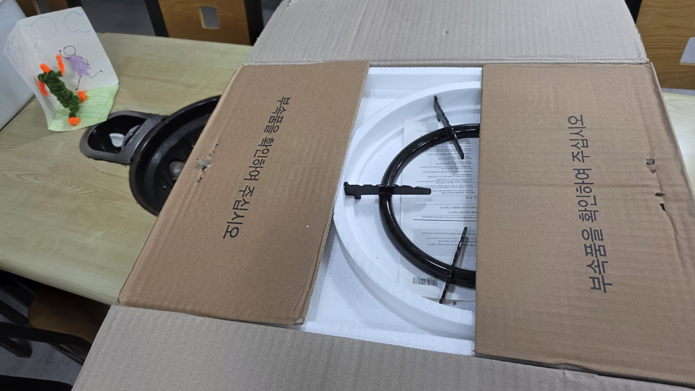

5. **삼발이·버너 구성품** — `20260910_171317.jpg` (1536×865)
   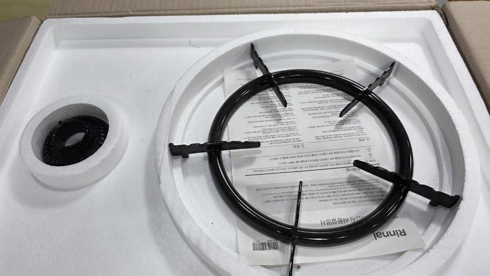

6. **제품 본체와 스테인리스 상판** — `20260910_171631.jpg` (1536×865)
   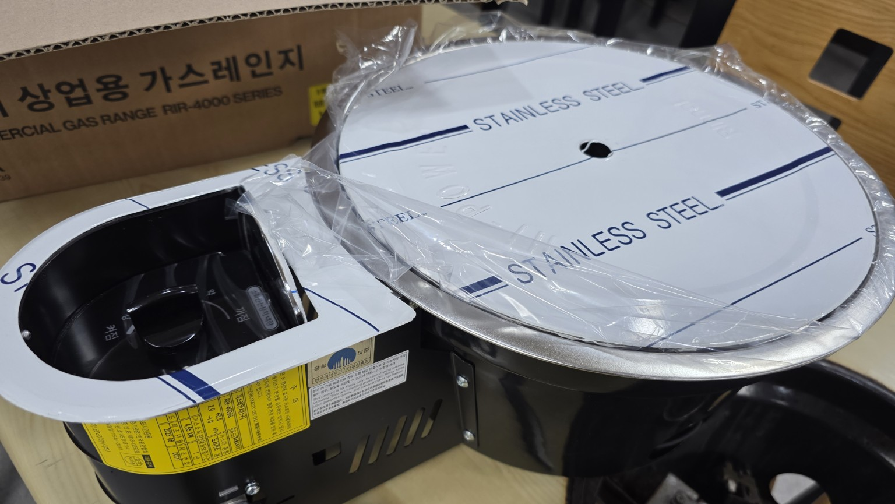

7. **삼발이·버너 분리 확인** — `20260910_171634.jpg` (1536×865)
   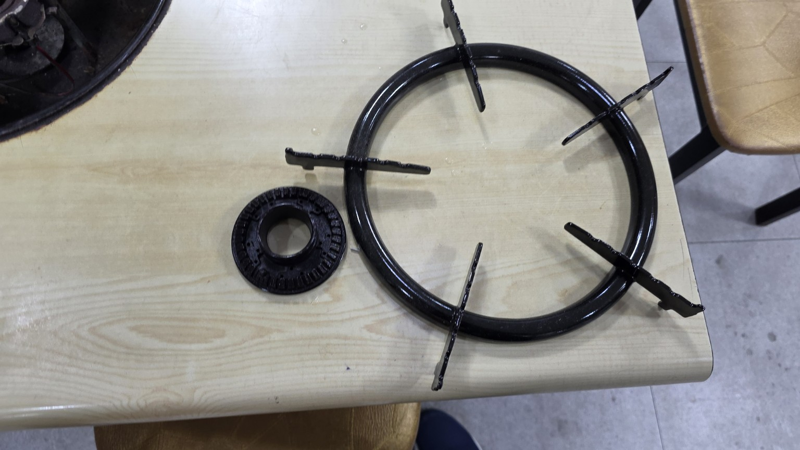

8. **제품 조립 상태** — `20260910_171741.jpg` (1536×865)
   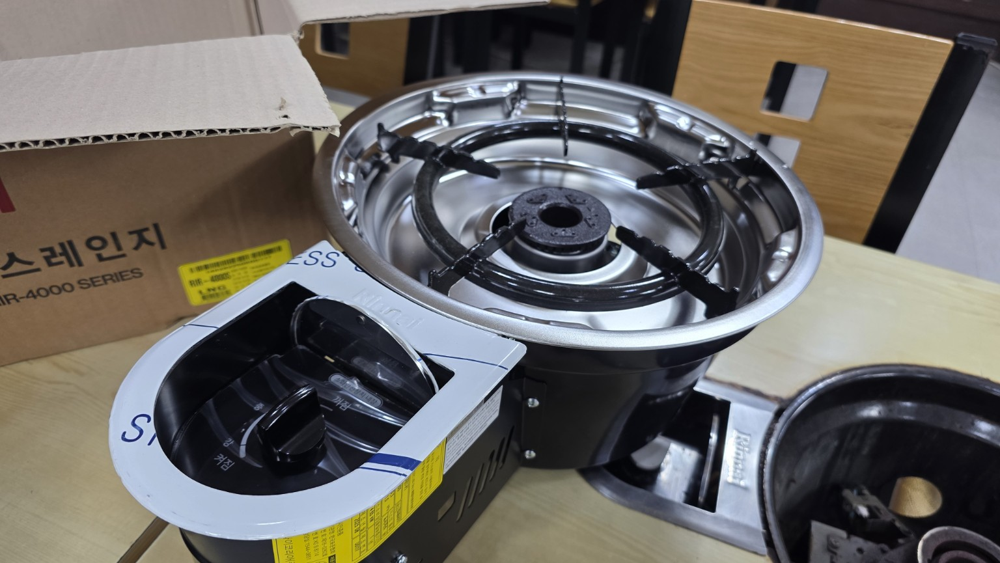

9. **제품 라벨 확대** — `Scan_20260910_171808.jpg` (1536×819)
   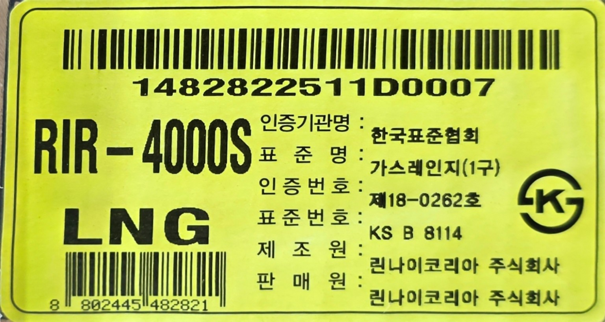

10. **RIR-4000S 사용설명서 1~3쪽** — `KakaoTalk_Photo_2026-09-14-10-55-18 007.jpeg` (2048×977)
   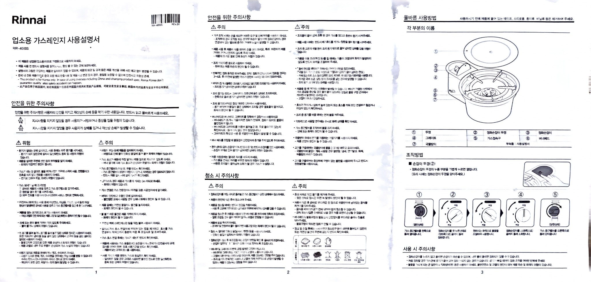

11. **RIR-4000S 사용설명서 4~6쪽** — `KakaoTalk_Photo_2026-09-14-10-55-18 006.jpeg` (2048×997)
   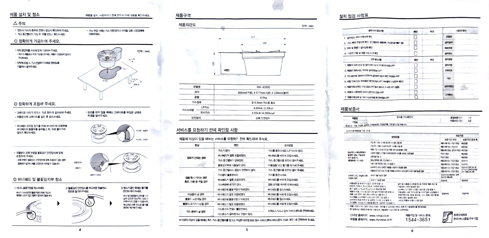

12. **개별 제품 라벨 1** — `KakaoTalk_Photo_2026-09-14-10-55-18 005.jpeg` (1540×800)
   

13. **개별 제품 라벨 2** — `KakaoTalk_Photo_2026-09-14-10-55-18 004.jpeg` (1693×920)
   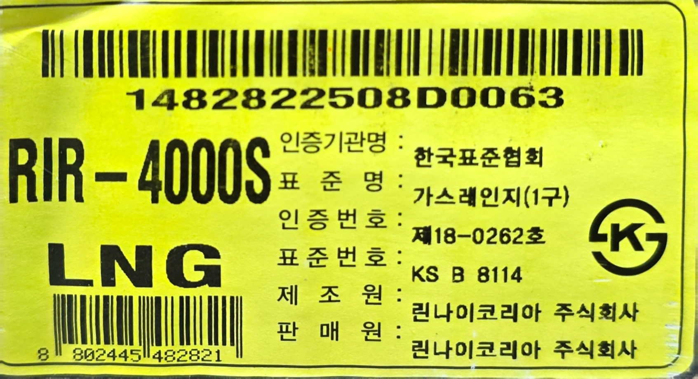

14. **개별 제품 라벨 3** — `KakaoTalk_Photo_2026-09-14-10-55-17 003.jpeg` (2032×1130)
   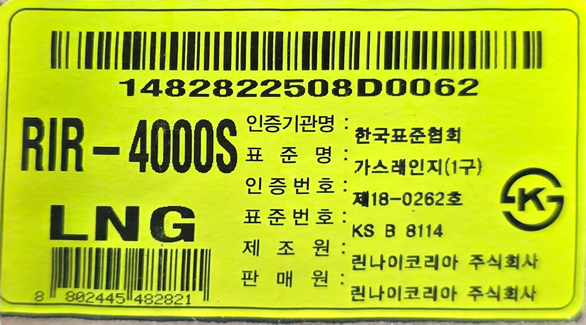

15. **개별 제품 라벨 4** — `KakaoTalk_Photo_2026-09-14-10-55-17 002.jpeg` (1649×810)
   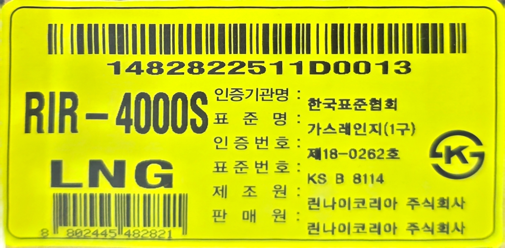

16. **개별 제품 라벨 5** — `KakaoTalk_Photo_2026-09-14-10-55-17 001.jpeg` (1498×799)
   

17. **Vercel Git 설정 화면 — 저장소 연결 전 상태 확인** — `340466ea-b955-46d2-b10e-516d9ca5c4df.png` (2048×1638)
   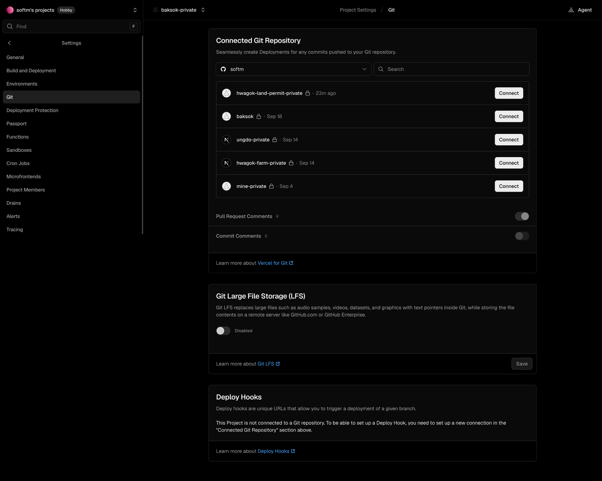

18. **Vercel Git 설정 화면 — GitHub 저장소 연결 완료 확인** — `7cce484d-39eb-4bac-b6cb-3dbc7f20b84a.png` (2048×1983)
   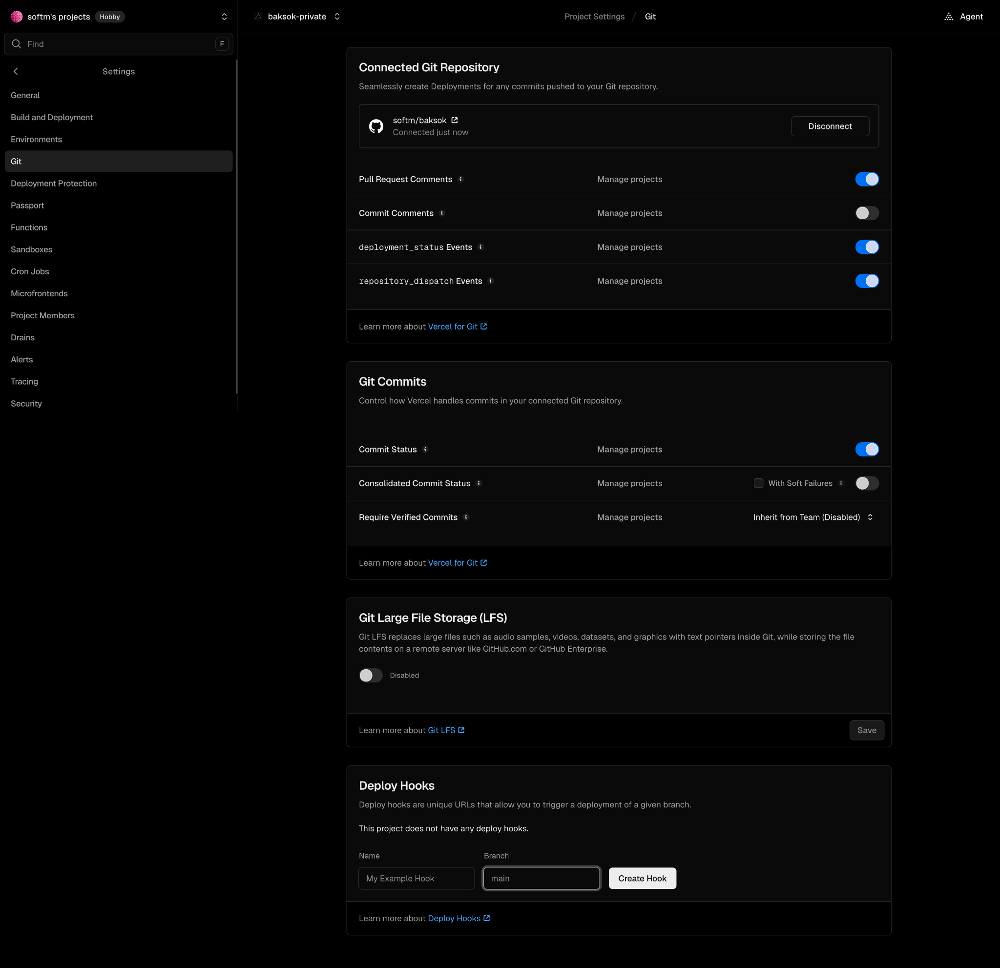

### 동영상

- 제품 배송·개봉 확인 영상: `media/20260910_171743.mp4`

## 8. 배포 운영 규칙 요약

1. 공개 콘텐츠는 `*-public` Public 저장소를 원본으로 사용한다.
2. 비공개 콘텐츠는 `*-private` Private 저장소를 원본으로 사용한다.
3. 비공개 사이트는 **인증 없이 원문을 노출하지 않는다**.
4. 비공개 콘텐츠는 Vercel 서버가 GitHub API로 최신 원본을 실시간 읽는다.
5. 비공개 GitHub token은 서버 환경변수로만 사용하며 브라우저에 노출하지 않는다.
6. 새 기록을 배포하면 상세페이지, 프로젝트 홈, 최상위 Projects까지 연결 상태를 점검한다.
7. 배포 완료 보고에는 Git repo, 경로, 공개/비공개 여부, 운영 URL, 실제 검증 상태를 함께 표시한다.

## 9. 첨부 파일 수

- 이미지: **18개**
- 동영상: **1개**
- 전체 미디어: **19개**