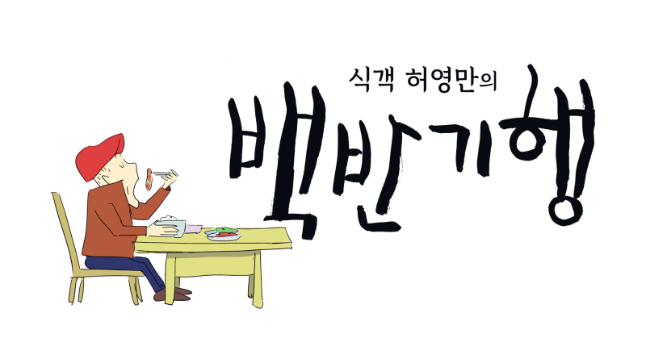
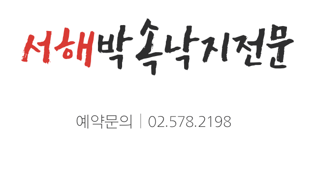
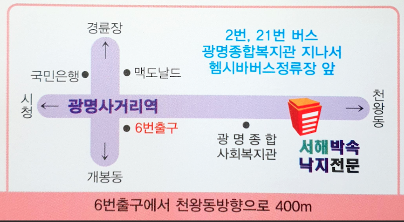
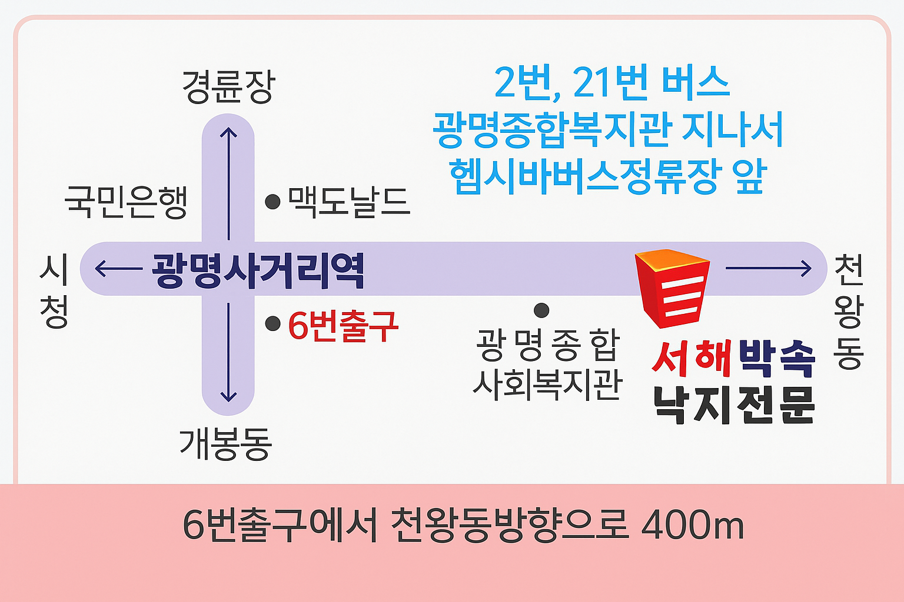
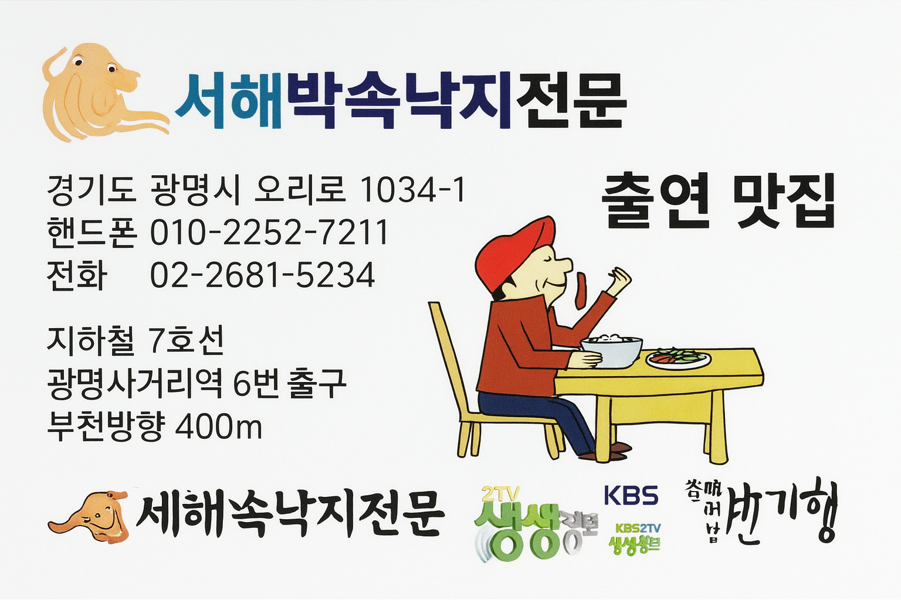
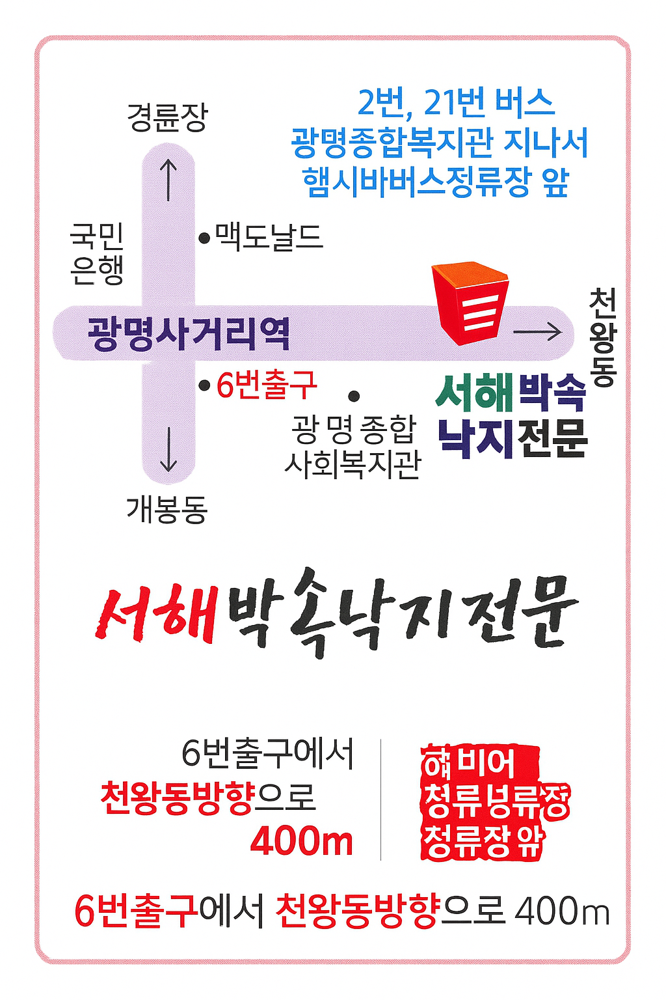
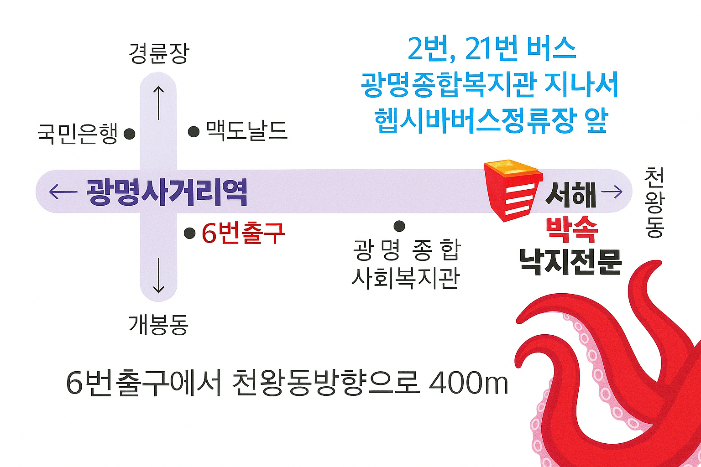

# 서해박속낙지전문 명함 디자인 정리

- 정리일: 2026-10-05
- 명함 규격: **86mm × 52mm**
- 상호: **서해박속낙지전문**
- 대표자: **김옥자**
- 주소: **경기도 광명시 오리로 1034-1**
- 휴대전화: **010-2252-7211**
- 전화: **02-2681-5234**
- 지하철: **7호선 광명사거리역 6번 출구 → 천왕동 방향 400m**
- 버스: **2번·21번 버스, 광명종합복지관 지나 헵시바LPG충전소 정류장 하차**
- 방송 출연: **KBS 2TV 생생정보**, **식객 허영만의 백반기행**

## 박속낙지 기본 이해

박속낙지는 박의 속과 낙지를 이용해 끓이는 연포탕 계열의 음식이다.

- 대표 메뉴: 박속낙지
- 부메뉴: 낙지볶음, 산낙지
- 박속: 흥부놀부 이야기의 바가지를 만드는 ‘박’의 속을 식재료로 이용

## 앞면 디자인 진행

### 초기 방향
- 방송 출연 로고를 상단에 배치
- 상호를 크게 강조
- 주소·전화·교통정보 및 주요 메뉴 표시
- KBS 2TV 생생정보와 식객 허영만의 백반기행 출연 사실을 홍보 요소로 활용

### 최종 선호 방향
사용자가 직접 제작한 앞면의 분위기를 기준으로 한다.

- 흰색/아이보리 계열의 깨끗한 배경
- **‘서해’는 붉은색**, 나머지 상호는 검정색 붓글씨 계열
- 붉은 낙지/문어 일러스트를 모서리에 배치
- 과도하게 많은 색을 사용하지 않고 빨강·검정 중심으로 구성
- 상호의 정확한 표기는 **서해박속낙지전문**
- 샘플용 Fax/E-mail/Web 정보는 실제 인쇄본에서는 제거하거나 실제 정보로 교체

## 뒷면 약도

### 필수 표기
- 광명사거리역
- 6번 출구
- 경륜장
- 국민은행
- 맥도날드
- 광명종합사회복지관
- 천왕동 / 개봉동 / 시청 방향
- 서해박속낙지전문 위치

### 강조 문구
**6번 출구에서 천왕동 방향으로 400m**

**2번, 21번 버스  
광명종합복지관 지나서  
헵시바LPG충전소 정류장 앞 하차**

뒷면 역시 앞면과 같은 빨강·검정 중심의 스타일을 사용하고,
`헵시바LPG충전소 정류장 앞`과 `6번 출구에서 천왕동 방향으로 400m`가
가장 먼저 눈에 들어오도록 굵기와 크기를 키운다.

## 디자인 이미지 기록

### 이미지 01 — `01_방송로고_KBS2TV생생정보로고_로고파일.jpg`

### 이미지 02 — `01_서해박속낙지_명함_약도.png`

### 이미지 03 — `1f07a6a1-082e-4998-ba7e-033d57ed308a.png`

### 이미지 04 — `4df6a38a-e46b-48c9-96c3-021215ed186e.png`

### 이미지 05 — `5f9b43a4-0071-4df9-a14c-e134e91dd766.png`

### 이미지 06 — `987560db-75d0-4dc3-b82d-3d5d573dd8dd.png`

### 이미지 07 — `a_2d_digital_map_in_korean_provides_directions_to.png`

### 이미지 08 — `a_business_card_design_for_서해박속낙지전문_a_restauran.png`

### 이미지 09 — `a_business_card_for_a_korean_restaurant_named_서해박.png`

### 이미지 10 — `a_business_card_for_a_korean_restaurant_specializi.png`

### 이미지 11 — `a_business_card_for_서해박속낙지전문_seohae_baksok_nakj.png`

### 이미지 12 — `a_map_image_features_directions_to_서해박속낙지전문_seoha.png`

### 이미지 13 — `a_map_in_korean_provides_directions_to_서해박속낙지전문.png`

### 이미지 14 — `c4f4ffe4-47a8-4788-b747-5000c64195e7.png`

### 이미지 15 — `간판_박속낙지.jpg`

### 이미지 16 — `백반기행_로고.png`

